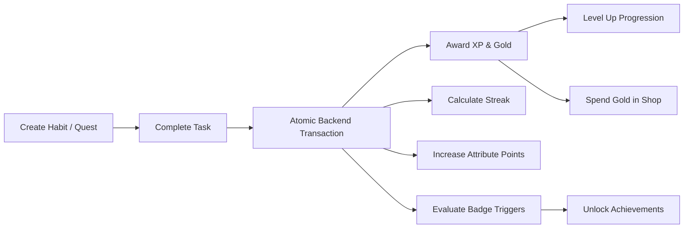
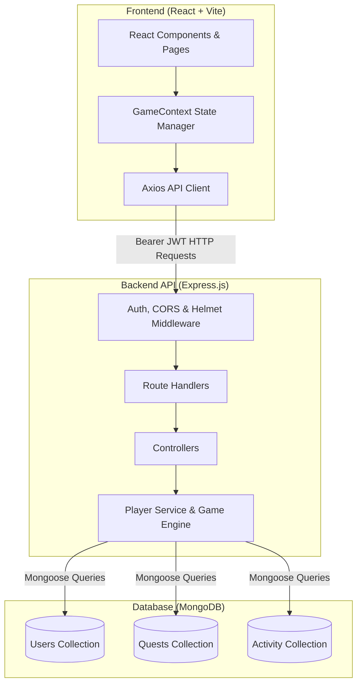

# ⚔️ ShadowQuest — Gamified Habit RPG

> **Transform everyday routines into epic quests.** Level up your character, build unbroken streaks, boost real-life attributes, earn gold, and unlock collectible avatar frames.

[](https://nodejs.org/)
[](https://react.dev/)
[](https://vitejs.dev/)
[](https://expressjs.com/)
[](https://www.mongodb.com/)
[](https://vercel.com/)
[](https://render.com/)

---

## 📖 Table of Contents

- [Overview](#-overview)
- [How It Works (Game Mechanics)](#-how-it-works-game-mechanics)
- [System Architecture](#-system-architecture)
- [Project Structure](#-project-structure)
- [API Reference](#-api-reference)
- [Local Development Setup](#-local-development-setup)
- [Production Deployment](#-production-deployment)
- [Game Engine Rules](#-game-engine-rules)

---

## 🌟 Overview

**ShadowQuest** is a full-stack web application that treats habit tracking like a dark-fantasy roleplaying game. Every task completed awards experience points (XP), boosts character attributes, pays out gold bounty, and extends daily streaks.

### Key Highlights
- **Character RPG Progression**: Level up from a novice wanderer to high-tier ranks with custom titles and stat distributions.
- **Real-Life RPG Attributes**: Tasks map to **Strength**, **Intellect**, **Discipline**, or **Charisma**.
- **Timezone-Aware Streaks**: Calculates streaks, streak-at-risk warnings, and daily resets based on each player's local timezone.
- **In-Game Economy & Shop**: Spend hard-earned gold to purchase and equip aesthetic avatar frames.
- **19 Unlockable Badges**: Milestone-based achievements for streaks, completion counts, categories, and wealth.
- **Concurrency & Race-Condition Safe**: Atomic database queries prevent double payouts or exploits.

---

## ⚙️ How It Works (Game Mechanics)



### 1. Quests & Difficulty Rewards
Each quest belongs to a category (**Food**, **Fitness**, **Study**, **Sleep**, **General**) and rewards a specific attribute:

| Difficulty | XP Awarded | Gold Earned | Use Case Example |
|---|:---:|:---:|---|
| **Easy** | `+15 XP` | `+3 Gold` | Drink a glass of water, make the bed |
| **Normal** | `+30 XP` | `+6 Gold` | 30-minute reading session, 11 PM bedtime |
| **Hard** | `+50 XP` | `+10 Gold` | Intensive gym workout, submit tax documents |
| **Epic** | `+80 XP` | `+16 Gold` | Complete major project milestone |

### 2. Quadratic XP Curve
Levels demand progressively greater effort. The XP needed to advance to level \( L + 1 \) is computed by:
$$\text{XP to Next Level}(L) = 20L^2 + 100L + 260$$

- **Level 1**: 380 XP
- **Level 2**: 540 XP
- **Level 3**: 740 XP
- *Excess XP rolls over seamlessly into subsequent levels.*

### 3. Timezone-Aware Streak Engine
- Streaks increment when the player completes their first quest of the calendar day.
- If no quest is completed yet today and one was finished yesterday, the player is flagged with `streakAtRisk: true`.
- If a calendar day is missed, the streak breaks and resets.
- Calculations use the player's detected IANA timezone (e.g., `Asia/Kolkata`, `America/New_York`) rather than UTC server time.

### 4. Lazy Quest Resets
- **Daily Quests**: Once completed, they remain checked off for today. At the start of the player's next calendar day, they automatically reset to active without requiring background cron jobs.
- **Weekly Quests**: Reset on Monday morning in the user's timezone.
- **One-time Quests**: Remain completed permanently; overdue dates are flagged if missed.

---

## 🏗️ System Architecture



---

## 📁 Project Structure

```
arrise/
├── .gitignore                     # Top-level Git ignore (ignores .env, node_modules, dist)
├── README.md                      # Comprehensive project documentation (this file)
│
├── backend/                       # Express.js REST API
│   ├── .env.example               # Backend environment variables template
│   ├── server.js                  # Server entry point and database connection bootstrapper
│   ├── app.js                     # Express app configuration, middleware, and route mounting
│   ├── config/
│   │   ├── env.js                 # Environment validation and configuration loader
│   │   └── db.js                  # Mongoose connection handler
│   ├── models/
│   │   ├── User.js                # User schema (level, xp, gold, streak, attributes, frames)
│   │   ├── Quest.js               # Quest schema (difficulty, repeat schedule, due dates)
│   │   └── Activity.js            # Immutable audit log for completions, level-ups, badges
│   ├── routes/
│   │   ├── authRoutes.js          # /api/auth (signup, login, session restore)
│   │   ├── questRoutes.js         # /api/quests (CRUD, atomic complete)
│   │   ├── playerRoutes.js        # /api/player (profile, weekly stats, settings)
│   │   ├── shopRoutes.js          # /api/shop (catalog, buy, equip)
│   │   ├── badgeRoutes.js         # /api/badges (badge unlock status)
│   │   └── activityRoutes.js      # /api/activity (recent player events)
│   ├── controllers/               # Request handling, input sanitation, responses
│   ├── middleware/
│   │   ├── authMiddleware.js      # JWT verification & req.user attachment
│   │   ├── errorHandler.js        # Centralized HTTP error handler
│   │   └── validateObjectId.js    # Validates MongoDB ObjectIDs in URL params
│   ├── game-engine/
│   │   ├── xpCurve.js             # XP progression formulas
│   │   ├── economy.js             # Reward calculation per difficulty
│   │   ├── streak.js              # Timezone-based streak evaluation
│   │   └── badges.js              # Badge requirements and triggers
│   ├── data/
│   │   └── frames.js              # Avatar frame catalog and pricing
│   ├── services/
│   │   └── playerService.js       # Player state mutations, concurrency retries
│   ├── utils/
│   │   ├── dates.js               # Day-key generation and timezone utilities
│   │   ├── AppError.js            # Custom error class
│   │   └── asyncHandler.js        # Async try/catch wrapper
│   └── scripts/
│       └── seed.js                # Seeds demo player and default quests
│
└── frontend/                      # React 18 + Vite SPA
    ├── index.html                 # Main HTML entry point
    ├── vite.config.js             # Vite configuration
    ├── vercel.json                # Single-page-app rewrite configuration for Vercel
    └── src/
        ├── App.jsx                # Router setup and authentication guards
        ├── main.jsx               # React DOM root
        ├── api/
        │   └── client.js          # Configured Axios instance with auth interceptors
        ├── context/
        │   └── GameContext.jsx    # Global game state provider (quests, player, shop, toasts)
        ├── pages/
        │   ├── Landing.jsx        # Public promotional hero page
        │   ├── Auth.jsx           # Sign in / Sign up page
        │   ├── Dashboard.jsx      # Quests due today, weekly chart, active streak, attributes
        │   ├── QuestLog.jsx       # Complete quest manager with category/status filters
        │   ├── Shop.jsx           # Avatar frames catalog and purchase interface
        │   ├── Profile.jsx        # Badges collection and character stat sheet
        │   └── Settings.jsx       # Sound toggles, timezone, notifications, account deletion
        ├── components/
        │   ├── AppShell.jsx       # Sidebar navigation and authenticated layout
        │   ├── QuestCard.jsx      # Interactive quest card with completion animation
        │   ├── Avatar.jsx         # User avatar with equipped cosmetic frame
        │   ├── XPBar.jsx          # Dynamic animated level progression bar
        │   ├── BadgeCard.jsx      # Achievement badge card
        │   └── ToastLayer.jsx     # Reward toast notifications on quest completion
        └── styles/
            ├── globals.css        # Theme variables, typography, custom scrollbars
            ├── app.css            # Component styles
            └── auth.css           # Auth page styling
```

---

## 📡 API Reference

All protected endpoints require the header: `Authorization: Bearer <token>`.

### Authentication
| Method | Endpoint | Description | Auth Required |
|---|---|---|:---:|
| `POST` | `/api/auth/signup` | Create account (`name, email, password, timezone`) | No |
| `POST` | `/api/auth/login` | Log into existing account (`email, password`) | No |
| `GET` | `/api/auth/me` | Rehydrate session using stored JWT | Yes |

### Quests
| Method | Endpoint | Description | Auth Required |
|---|---|---|:---:|
| `GET` | `/api/quests` | Get player's quests (filters: `category, status, scope`) | Yes |
| `POST` | `/api/quests` | Create new quest | Yes |
| `PATCH` | `/api/quests/:id` | Update title, difficulty, or schedule of open quest | Yes |
| `DELETE`| `/api/quests/:id` | Delete a quest | Yes |
| `POST` | `/api/quests/:id/complete` | Atomically complete quest & award XP/gold/stats | Yes |

### Player & Stats
| Method | Endpoint | Description | Auth Required |
|---|---|---|:---:|
| `GET` | `/api/player` | Fetch complete player profile & attributes | Yes |
| `PATCH` | `/api/player` | Update profile (`name, email, timezone, settings`) | Yes |
| `DELETE`| `/api/player` | Permanently delete account and all associated data | Yes |
| `GET` | `/api/player/week` | 7-day completion activity for dashboard graph | Yes |

### Shop & Badges
| Method | Endpoint | Description | Auth Required |
|---|---|---|:---:|
| `GET` | `/api/shop` | List cosmetic frames with owned/equipped state | Yes |
| `POST` | `/api/shop/:id/buy` | Purchase and equip a frame with gold | Yes |
| `POST` | `/api/shop/:id/equip` | Toggle equip/unequip on an owned frame | Yes |
| `GET` | `/api/badges` | List all 19 badges with player unlock progress | Yes |
| `GET` | `/api/activity` | Recent audit feed (limit default 6, max 50) | Yes |

---

## 💻 Local Development Setup

### Prerequisites
- [Node.js](https://nodejs.org/) (version 18.18 or higher)
- [MongoDB](https://www.mongodb.com/) (running locally on port `27017` or a MongoDB Atlas URI)

### 1. Clone & Install
```bash
git clone https://github.com/Nitesh0986/shadowquest-habits.git
cd shadowquest-habits
```

### 2. Configure & Start Backend
```bash
cd backend
npm install
cp .env.example .env

# Optional: seed sample player (demo@shadowquest.test / password123)
npm run seed

# Run in development mode (auto-reload)
npm run dev
```
*Backend runs on `http://localhost:5000` (Health check: `http://localhost:5000/api/health`).*

### 3. Configure & Start Frontend
In a second terminal:
```bash
cd frontend
npm install
cp .env.example .env

# Run Vite dev server
npm run dev
```
*Frontend runs on `http://localhost:5173`.*

---

## 🚀 Production Deployment

ShadowQuest is optimized for split deployment: **Vercel** for the frontend, **Render** for the backend, and **MongoDB Atlas** for the database.

### 1. Database (MongoDB Atlas)
1. Create a free **M0 cluster** at [MongoDB Atlas](https://www.mongodb.com/cloud/atlas).
2. Add `0.0.0.0/0` to Network Access.
3. Create a database user and copy the connection URI:
   ```
   mongodb+srv://<username>:<password>@cluster0.xxxxx.mongodb.net/shadowquest?retryWrites=true&w=majority
   ```

### 2. Backend (Render)
1. Create a new **Web Service** on [Render](https://render.com) connected to this GitHub repo.
2. Settings:
   - **Root Directory**: `backend`
   - **Build Command**: `npm install`
   - **Start Command**: `node server.js`
3. Environment Variables:
   - `NODE_ENV`: `production`
   - `MONGO_URI`: `<Your MongoDB Atlas connection URI>`
   - `JWT_SECRET`: `<A long random secret string>`
   - `CLIENT_ORIGIN`: `https://*.vercel.app`

### 3. Frontend (Vercel)
1. Import this GitHub repo on [Vercel](https://vercel.com).
2. Settings:
   - **Root Directory**: `frontend`
   - **Framework Preset**: `Vite`
3. Environment Variables:
   - `VITE_API_URL`: `https://<your-render-service>.onrender.com/api`
4. Deploy!

---

## 🛡️ Game Engine Rules

- **Anti-Cheat Atomic Claims**: Quest completion uses MongoDB `findOneAndUpdate({ _id, done: false })` — duplicate requests or race conditions will never pay out twice.
- **Optimistic Concurrency**: Player inventory and gold updates implement document version checking with automatic retries on contention.
- **Auditable Activity Log**: Every rewarded action writes to the `activities` collection, preserving accurate historical analytics even when daily quests reset.

---

## 📜 License

This project is licensed under the [MIT License](LICENSE).
